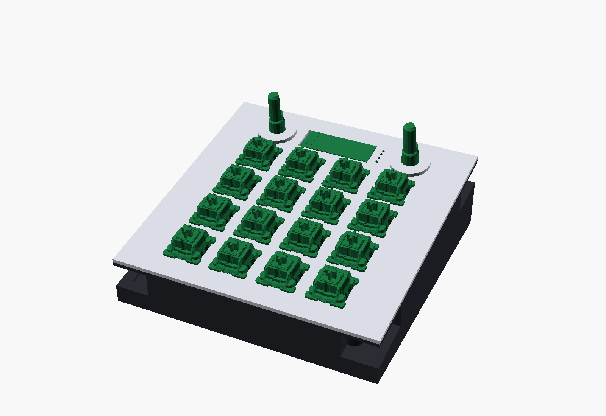
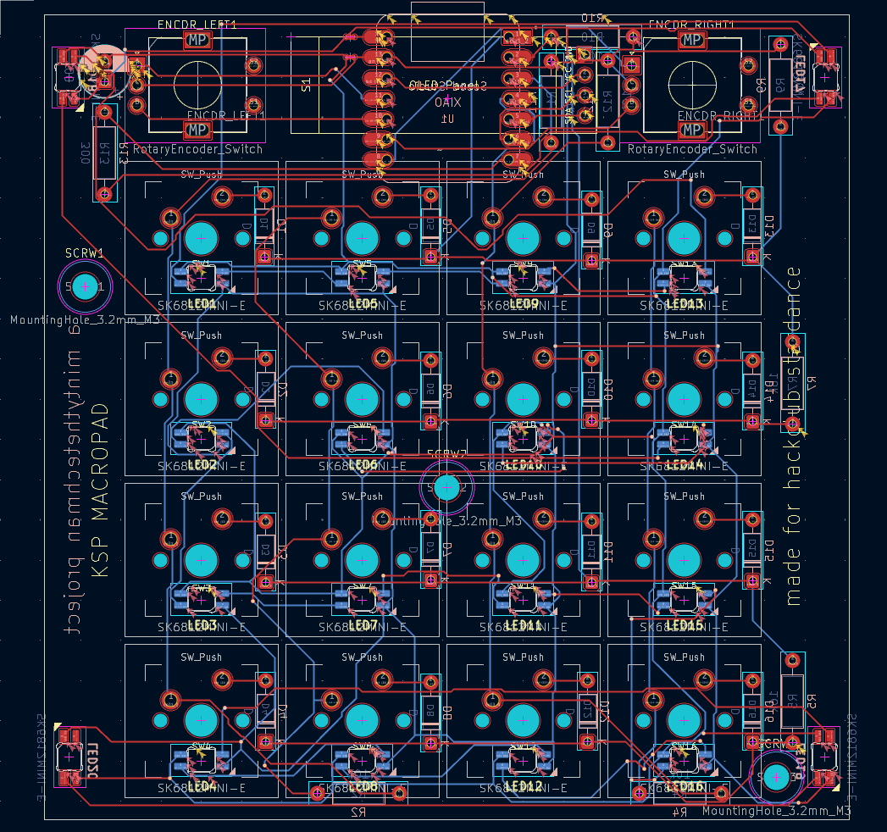
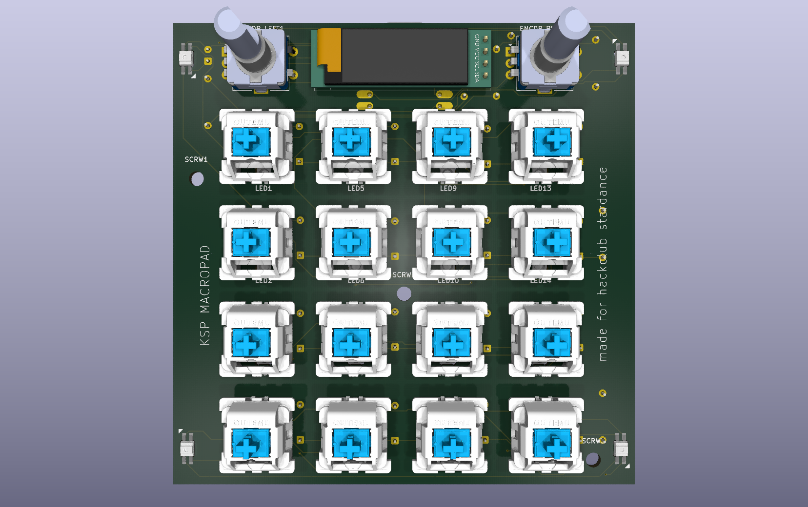
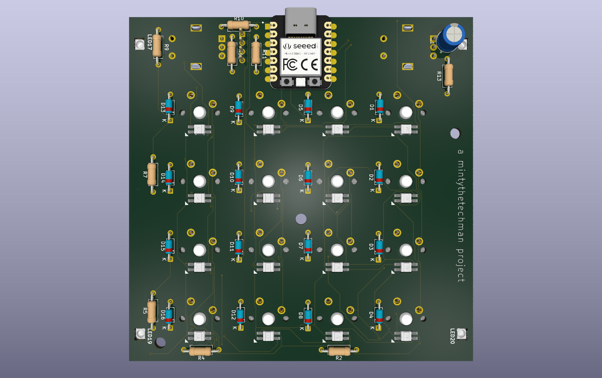
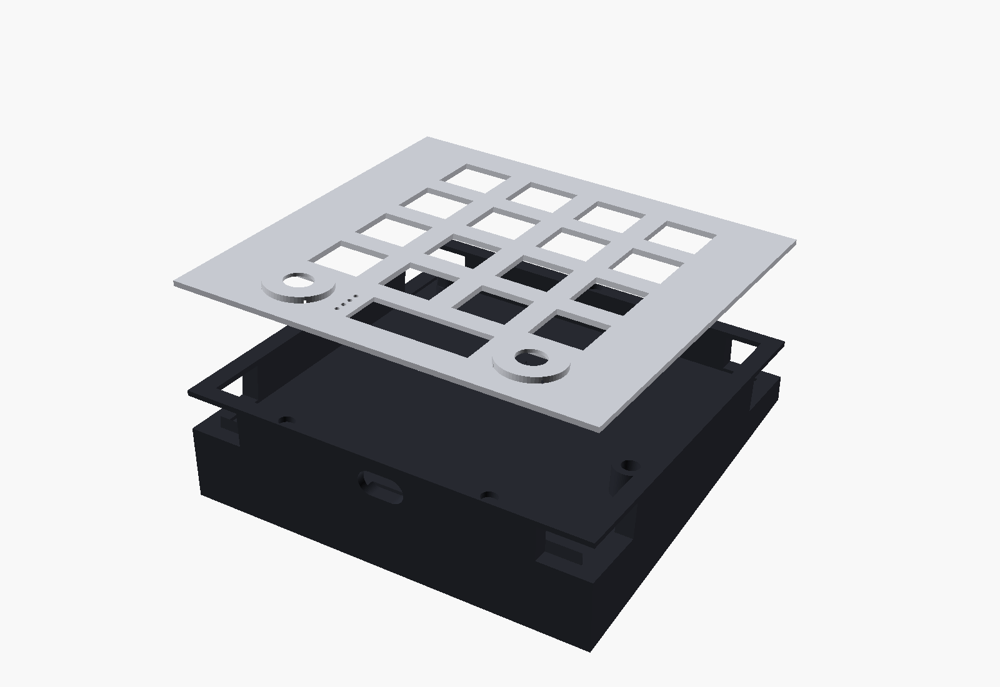
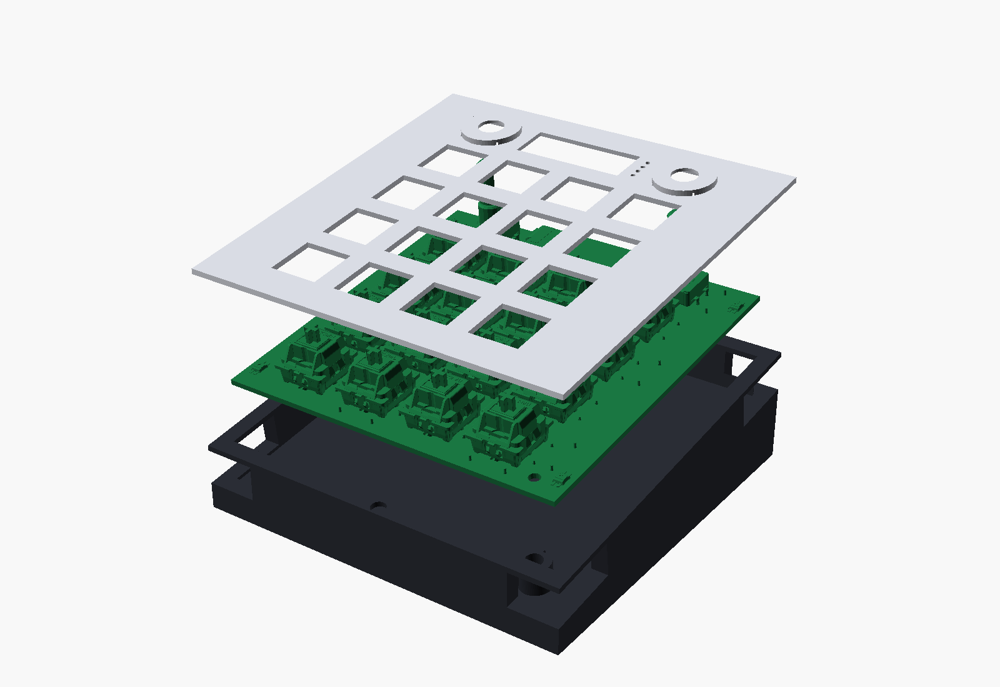

# KSP MacroPad

A custom macropad built for Kerbal Space Program, made for Hack Club's Stardance Challenge.

16 macro keys and 2 rotary encoders on a custom PCB, driven by a Seeed XIAO RP2040. The keys don't send keystrokes. They trigger full flight procedures (launch, gravity turn, circularize, rendezvous, suicide burn, an interplanetary autopilot) that a companion KSP mod runs inside the game. The mod talks to the pad over USB serial, and sends state back for per-key RGB LEDs, underglow, and a 128x32 OLED.

The key matrix is read through a resistor ladder on 4 ADC pins instead of 8 GPIO pins, which is what makes everything fit on the XIAO's 11 pins.



## Hardware

- Seeed XIAO RP2040
- 16 MX switches in a 4x4 grid (20 mm pitch), read as an analog matrix on A0 to A3
- 2 EC11 rotary encoders (left on D10/D9, right on D7/D8)
- 20 SK6812 MINI-E RGB LEDs on D6: 16 per-key backlights and 4 underglow
- 0.91" SSD1306 128x32 OLED over I2C (SDA D4, SCL D5)
- 100 x 100 mm 2-layer PCB
- 3D-printed case tilted 7°, with the plate held on by magnets

| | |
|---|---|
|  |  |
|  |  |

### How the analog matrix works

A normal 4x4 matrix needs 8 pins, and after the encoders, OLED and LEDs there were only 4 left. So each pin carries two lines:

- A2 and A3 each drive two column lines, one straight and one through a 10k resistor.
- A0 and A1 each read two row lines, one straight and one through a 16k resistor, into a 10k pulldown.

The firmware drives one column pin high at a time and reads both row pins. A pressed key puts one of four voltages on its row pin depending on which resistors are in its path:

| Column path | Row path | Row pin voltage |
|---|---|---|
| 10k | 16k | 0.70 to 0.82 V |
| direct | 16k | 0.98 to 1.13 V |
| 10k | direct | 1.28 to 1.45 V |
| direct | direct | 2.62 to 2.85 V |

Those ranges cover 1% resistors across the full 1N4148 diode drop range, and every band has at least 0.15 V of margin to the next, so all 16 keys decode reliably.

## Case





- The board and plate are rotated 7° as one rigid unit on a wedge floor. The bottom stays flat on the desk.
- The plate sits at the MX standard 5.0 mm above the PCB, with 14 mm switch cutouts.
- The encoders come through round holes in raised collars, and the OLED window matches the screen glass.
- The PCB mounts on 3 standoffs with M3 heat-set inserts. The standoffs are perpendicular to the board, with relief notches where parts on the back of the board sit close.
- The plate is held on by 3 pairs of 4 mm magnets, so there are no screws on top.
- The USB-C opening is sized for the plug body and lines up with the tilted connector.
- Underglow notches wrap each corner so the LED light reaches the desk.
- Overall size: 110.4 x 109.8 x 34.2 mm.

The case is fully parametric in [CAD/ksp_macropad_case.scad](CAD/ksp_macropad_case.scad), and it was checked for interference against the real board's STEP model.

## Key Layout

| ID | Macro | ID | Macro |
|---|---|---|---|
| `0x00` | Launch sequence | `0x08` | Docking prep |
| `0x01` | Auto gravity turn | `0x09` | Landing prep |
| `0x02` | Circularize | `0x0A` | Suicide burn arm (hold 1 s) |
| `0x03` | Time warp to next event | `0x0B` | Precision input toggle (encoder mode 2) |
| `0x04` | Intercept | `0x0C` | Transmit science |
| `0x05` | Orbit sync | `0x0D` | Resource monitor |
| `0x06` | Rendezvous prep | `0x0E` | Auxiliary toggle (encoder mode 3) |
| `0x07` | Deorbit burn | `0x0F` | Autopilot |

Macros that fly the vessel queue up: press CIRCULARIZE while AUTO GRAVITY TURN is still flying and it starts as soon as the turn finishes. The OLED shows the active macro and what's queued next.

### Encoder modes

| Mode | Left encoder | Right encoder |
|---|---|---|
| 1: Normal | Throttle | Time warp |
| 2: Precision | Target throttle % | Target heading |
| 3: Auxiliary | Camera zoom | RCS thrust limit % |

## The KSP Mod

The mod ([mod/KSPMacropad](mod/KSPMacropad)) is a C# plugin for KSP 1.12. It:

- finds the pad automatically by listening for its hello packet on every COM port, and reconnects if it's unplugged
- runs all the macros, including a Lambert-solver transfer planner for AUTOPILOT and a closed-loop suicide burn
- drives every key LED and the underglow from live game state (resources, comms, upcoming maneuver nodes, time warp)
- detects MechJeb, Principia, FAR and Kerbalism, and disables the macros that would conflict with them

To install it, build the project in Visual Studio (.NET Framework 4.8) and copy `KSPMacropad.dll` into `GameData/KSPMacropad/Plugins/`. Optional settings go in `KSPMacropad.cfg` next to the DLL:

```
port = COM5
allow_with_mechjeb = true
```

## Serial Protocol

The firmware turns on a second USB CDC data port (in `boot.py`) alongside the REPL console.

**Pad to mod** (6 bytes): `[0x44, type, id, data_hi, data_lo, 0x77]`
- `type 0x01`: key press, `id` = key ID
- `type 0x02`: encoder turn, `id` = `(mode << 4) | encoder` (1 = left, 2 = right), data = signed 16-bit detent steps
- `type 0x03`: hello, sent every second so the mod can find the right port
- `type 0x04`: resync, asks the mod to resend every LED state after a lost connection

**Mod to pad** (5 bytes): `[0x77, id, state, data, 0x44]`
- `0x00` to `0x0F`: key LED state
- `0x10` to `0x13`: underglow state
- `0x14`: heartbeat (the pad shows `NO CONN` after 3 s without one)
- `0x15`: live throttle %
- `0x16`: live warp rate, as `data x 10^(state & 0x0F)`, with bit 7 of `state` set for physics warp
- `0x17` to `0x19`: active macro, next queued macro, queue length

LED state values are defined in `led_states.py` (firmware) and `LEDStates.cs` (mod), and the two have to stay in sync.

## Flashing the Firmware

1. Install [CircuitPython](https://circuitpython.org/board/seeeduino_xiao_rp2040/) on the XIAO RP2040.
2. Copy these libraries from the Adafruit CircuitPython bundle into `CIRCUITPY/lib/`:
   - `neopixel`
   - `adafruit_display_text`
   - `adafruit_displayio_ssd1306`
3. Copy `boot.py`, `code.py` and `led_states.py` from [Firmware/](Firmware/) to the root of `CIRCUITPY`.
4. Power-cycle the board (not just a soft reload) so `boot.py` can turn on the USB data port.

## Bill of Materials

| Qty | Part | Reference | Notes |
|---|---|---|---|
| 1 | Seeed XIAO RP2040 | U1 | |
| 16 | MX switches | SW1 to SW16 | |
| 16 | DSA 1U keycaps | | |
| 16 | 1N4148 diodes, through-hole | D1 to D16 | |
| 20 | SK6812 MINI-E RGB LEDs | LED1 to LED20 | reverse mount |
| 2 | EC11 rotary encoders, 20 mm shaft | ENCDR_LEFT1, ENCDR_RIGHT1 | |
| 1 | 0.91" 128x32 SSD1306 OLED, I2C | S1 | pinout GND, VCC, SCL, SDA |
| 1 | 100 µF electrolytic capacitor | C1 | LED supply |
| 2 | 10k resistor, 1% | R2, R4 | matrix columns |
| 2 | 16k resistor, 1% | R5, R7 | matrix rows |
| 4 | 10k resistor | R9 to R12 | ADC pulldowns |
| 1 | 300 Ω resistor | R13 | LED data line |
| 3 | M3 x 16 mm screws | | PCB to case |
| 3 | M3 x 5 x 4 mm heat-set inserts | | |
| 6 | 4 x 1 mm disc magnets | | plate retention, glued in pairs |
| 1 | PCB | | [production/gerbers.zip](production/gerbers.zip) |
| 1 | Case bottom, 3D printed | | [production/case_bottom.stl](production/case_bottom.stl) |
| 1 | Top plate, 3D printed | | [production/case_top_plate.stl](production/case_top_plate.stl) |

## Repository Layout

- [CAD/](CAD/): OpenSCAD case source, case STEP files, and the full assembled STEP
- [PCB/](PCB/): KiCad 10 project, board STEP, and footprint/3D model libraries
- [Firmware/](Firmware/): CircuitPython firmware
- [mod/](mod/): KSP C# plugin
- [production/](production/): gerbers, printable case STLs, and the firmware files
- [images/](images/): renders and screenshots

## Tools

- KiCad 10
- OpenSCAD
- CircuitPython
- Visual Studio
- Kerbal Space Program
