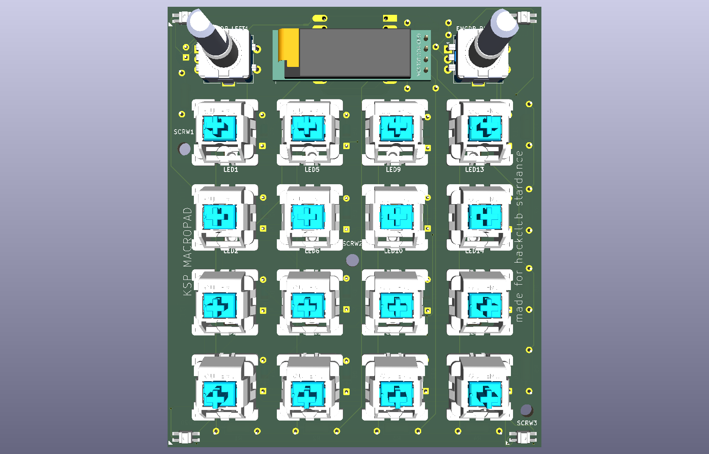
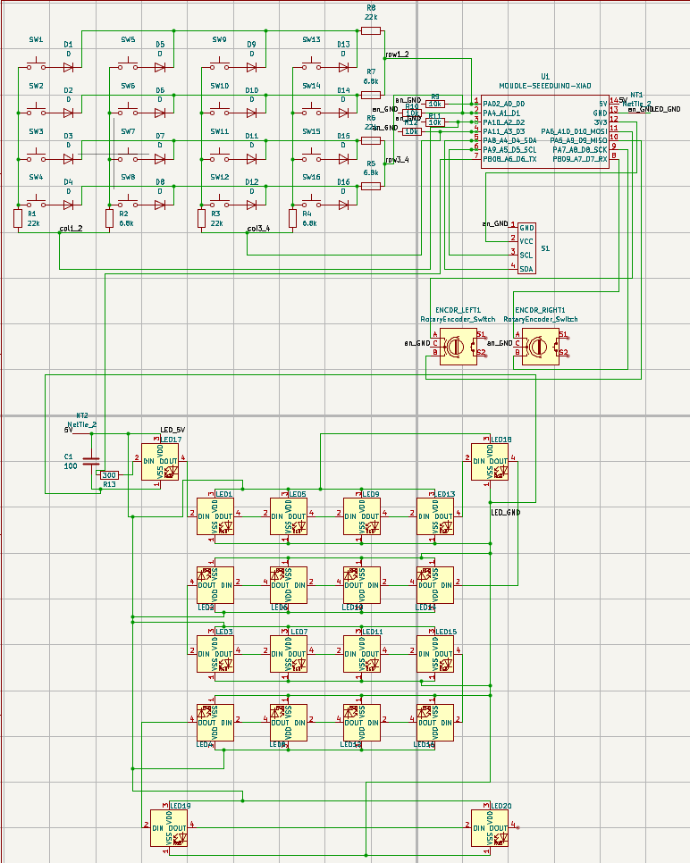
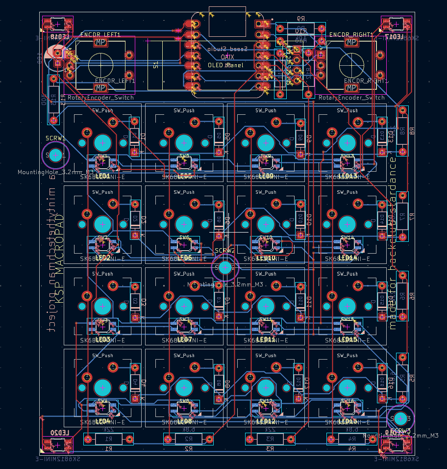

# KSP Macropad

A custom macropad built specifically for Kerbal Space Program, developed as part of Hack Club's Stardance Challenge.

16 macro keys + 2 rotary encoders on a custom PCB driven by a Seeed XIAO RP2040. The keys execute complex multi-step sequences like launch procedures, orbital maneuvers, and autonomous mission execution via a companion KSP mod. The mod communicates over USB serial, reads live game telemetry, and sends state back to the pad for per-key RGB LEDs and a 128x32 OLED display.

The key matrix uses an ADC-based resistor ladder instead of a traditional GPIO matrix, a custom solution to a pin shortage on the RP2040.

## Hardware
- Seeed XIAO RP2040
- 16 MX switches read through a 2x2 analog resistor ladder (A0–A3)
- 2 EC11 rotary encoders (D7–D10)
- 20 SK6812MINI-E NeoPixels: 16 per-key + 4 underglow (D6)
- SSD1306 128x32 OLED over I2C (D0/D1)
- 3D-printed case (OpenSCAD source + STLs in [design/](design/))

| | |
|---|---|
|  |  |

## Key Layout

| ID | Macro | ID | Macro |
|---|---|---|---|
| `0x00` | Launch sequence | `0x08` | Docking prep |
| `0x01` | Auto gravity turn | `0x09` | Landing prep |
| `0x02` | Circularize | `0x0A` | Suicide burn arm (hold 1 s) |
| `0x03` | Time warp to next burn | `0x0B` | Precision input toggle (encoder mode 2) |
| `0x04` | Intercept calculation | `0x0C` | Transmit science |
| `0x05` | Orbit sync | `0x0D` | Resource monitor |
| `0x06` | Rendezvous prep | `0x0E` | Auxiliary toggle (encoder mode 3) |
| `0x07` | Deorbit burn | `0x0F` | Autopilot |

### Encoder modes
| Mode | Left encoder | Right encoder |
|---|---|---|
| 1 — Normal | Throttle | Time warp |
| 2 — Precision | Target throttle % | Target heading |
| 3 — Auxiliary | Camera zoom | RCS thrust limit % |

## Serial Protocol
The firmware exposes a second USB CDC data port (enabled in `boot.py`) alongside the REPL console.

**Pad → mod** (6 bytes): `[0x44, type, id, data_hi, data_lo, 0x77]`
- `type 0x01` — key press, `id` = key ID
- `type 0x02` — encoder turn, `id` = `(mode << 4) | encoder` (1 = left, 2 = right), data = signed 16-bit detent steps

**Mod → pad** (5 bytes): `[0x77, id, state, data, 0x44]`
- `0x00`–`0x0F` — key LED state
- `0x10`–`0x13` — underglow state
- `0x14` — heartbeat (pad shows `NO CONN` after 3 s without one)
- `0x15` — live throttle % telemetry
- `0x16` — live warp index telemetry

LED state values are defined in `led_states.py` (firmware) and `LEDStates.cs` (mod), which must stay in sync.

## Flashing the Firmware
1. Install [CircuitPython](https://circuitpython.org/board/seeeduino_xiao_rp2040/) on the XIAO RP2040.
2. Copy these libraries from the Adafruit CircuitPython bundle into `CIRCUITPY/lib/`:
   - `neopixel`
   - `adafruit_display_text`
   - `adafruit_displayio_ssd1306`
3. Copy `boot.py`, `code.py`, and `led_states.py` from [firmware/](firmware/) to the root of `CIRCUITPY`.
4. Power-cycle the board (not just a soft reload) so `boot.py` can enable the USB data port.

## Repository Layout
- [design/](design/) — KiCad PCB + schematic, OpenSCAD case source, case STLs (completed)
- [firmware/](firmware/) — CircuitPython firmware, v0.2.1: key scanning, encoders, LEDs, OLED, and serial protocol working

## Branches
- `mod` — KSP 1.12.5 C# plugin (WIP): serial and packet-handling skeleton, macros not yet implemented
- `firmware` — merged into `main`
- `design` — merged into `main`, deleted

## Tools
- KiCad 10
- Fusion 360
- OpenSCAD
- CircuitPython
- Visual Studio
- KSP
